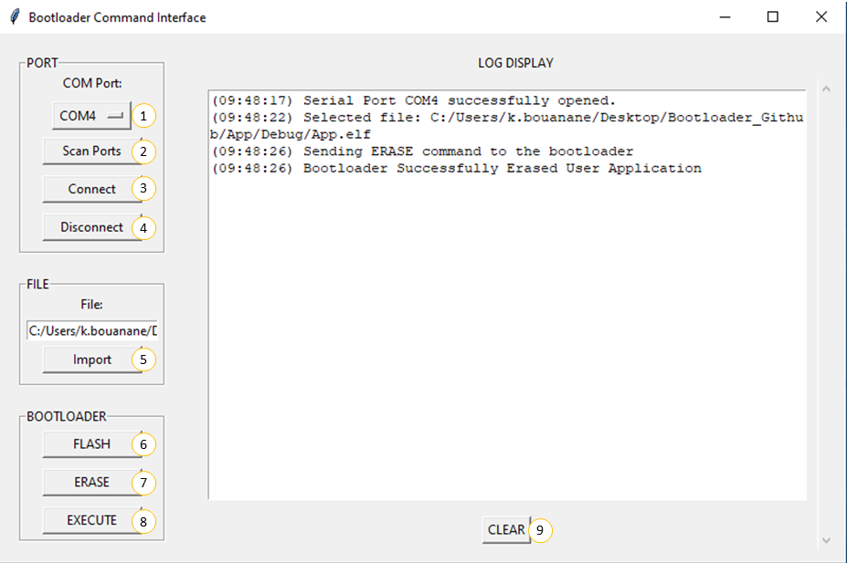
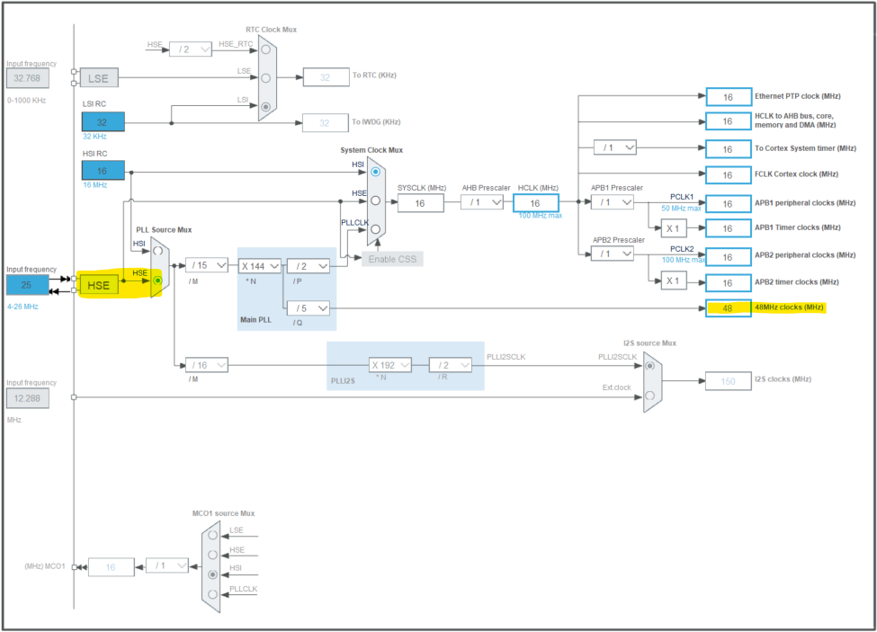

# **Custom Bootloader for STM32 Black Pill using USB CDC**

This personal project focuses on developing a customable bootloader specifically designed for the STM32F411 MCU, commonly known as the Black Pill board. The development of the bootloader is based on the HAL library and its main objective is to establish interaction between the microcontroller and a host computer using USB communication. The bootloader's primary functionality includes downloading new firmware, erasing or executing user application. To complement the bootloader, a desktop GUI has been developed using the Python tkinter library. This GUI facilitates the establishement of connection with the bootloader, allowing user to send requests and receive responses, with all events logged and displayed.

## **Table of Contents**
- [**Custom Bootloader for STM32 Black Pill using USB CDC**](#custom-bootloader-for-stm32-black-pill-using-usb-cdc)
  - [**Table of Contents**](#table-of-contents)
  - [**Setup Overview**](#setup-overview)
  - [**Bootloader Features**](#bootloader-features)
  - [**Development Environment**](#development-environment)
  - [**Files Structure**](#files-structure)
  - [**How to use the GUI interface**](#how-to-use-the-gui-interface)
  - [**Bootloader Flowchart**](#bootloader-flowchart)
  - [**Bootloader Project Configurations**](#bootloader-project-configurations)
    - [**GPIO Configuration**](#gpio-configuration)
    - [**RCC Configuration**](#rcc-configuration)
    - [**USB Configuration**](#usb-configuration)
    - [**Bootloader Linker Script**](#bootloader-linker-script)
    - [**App Linker Script**](#app-linker-script)
    - [**App Vector Table**](#app-vector-table)
  - [**Result**](#result)
    - [**Memory Usage**](#memory-usage)
    - [**Video Demonstration:**](#video-demonstration)

## **Setup Overview**

## **Bootloader Features**

- Flash Erase
- Flash Programming
- Checksum Verification
- Execute User Application
- Communication through USB

## **Development Environment**

- **Hardware**

    - STM32F411CEU6 (Black Pill)
    - ST-Link V2

- **Software**

    - STM32CubeIDE
    - STM32Programmer
    - Serial Terminal (Yet Another Terminal)

- **Python Libraries**
    
    - crcmod : CRC Modulation Library for Checksum Calculation and Verification
    - serial : Serial Communication Library for Interfacing with Serial Ports
    - tkinter : Tkinter Library for Python GUI Development

## **Files Structure**
    
    .
    ├── App                                 # STM32 Project for a simple blink application
    |   ├── ...
    |   ├── Debug                           # Debug folder
    |   |     └── App.elf                   # Generated binary file after project compilation
    |   └── STM32F411CEUX_FLASH.ld          # App Linker Script
    |
    ├── Bootloader                          # STM32 Project for the custom bootloader
    |   ├── ...
    |   ├── Core                            # Core folder
    |   |    ├── Inc                        # Header Files
    |   |    |    ├── bootloader.h          # Bootloader header file
    |   |    |    ├── flash.h               # Flash header file
    |   |    |    └── main.h                # Main program header file
    |   |    └── Src                        # Source Files
    |   |         ├── bootloader.c          # Bootloader source file
    |   |         ├── flash.c               # Flash source file
    |   |         ├── main.c                # Main program source code
    |   |         └── system_stm32f4xx.c    # System initialization file
    |   └── STM32F411CEUX_FLASH.ld          # Bootloader Linker Script
    |
    ├── python                              # Folder for the GUI interface
    |     ├── python_venv                   # Virtual environment that contains all dependencies
    |     ├── arm-none-eabi-objcopy.exe     # Executable file that helps convert elf to bin 
    |     ├── main.py                       # Python program for the GUI interface of the bootloader flasher
    |     └── serial_api.py                 # Python program offering an API to communicate with the bootloader
    | 
    ├── img                                 # Folder that contains images for README file
    └── README.md                           # README file

There are two projects in STM32CubeIDE: "App" and "Bootloader". The "App" project contains a simple blink application, and we are interested in the binary ELF file generated after compilation. This file will be converted into a .bin format by the Python program and sent to the STM32.

In the "Bootloader" project, there is a flash library that provides an API for manipulating flash memory, including write and erase operations. Additionally, the project involves the implementation of the bootloader program, which waits for and processes commands sent from the host computer.

To ensure the two programs reside in independent memory areas, the linker scripts of both projects were modified.

On the Python side, the project includes a virtual environment that ensures the availability of all library dependencies. The executable file "arm-none-eabi-objcopy.exe" is utilized in the main program to convert .elf files to .bin files. Furthermore, the "serial_api.py" file provides an API for communication with the bootloader.

## **How to use the GUI interface**

To enter the bootloader mode in the STM32, press and hold the User Key button before resetting the MCU.Release the button when the Blue LED start blinking 3 times.

Once in the bootloader mode, you can utilize the Python GUI interface, that is featuring nine buttons with the following functionnalities :

- **Button 1:** Port Selection: Allows choosing the COM port where the STM32 is connected.
- **Button 2:** Scan Ports: Scans and lists all available ports on the port menu. Should be clicked before clicking on the port menu.
- **Button 3:** Connect: Establishes a connection to the selected COM port.
- **Button 4:** Disconnect: Terminates the connection to the selected COM port.
- **Button 5:** Import File: Enables importing and ELF or BIN file. 
- **Button 6:** Flash Command: Sends the selected binary file to the bootloader for flashing.
- **Button 7:** Erase Command: Sends an erase command to the bootloader.
- **Button 8:** Execute Command: Sends an execute command to the bootloader.
- **Button 9:** Clear Log: Clears the log display.

## **Bootloader Flowchart**

## **Bootloader Project Configurations**

### **GPIO Configuration**

  

### **RCC Configuration**

### **USB Configuration**

  
  

### **Bootloader Linker Script**
 
The bootloader will keep the flash origin address because it is the first location to be executed after a reset. However, the memory size allocated for the bootloader is limited to 64K.

  

### **App Linker Script**

The user application resides in the memory address space that starts after the end address of the bootloader. It utilizes the remaining memory size of the flash.

  

### **App Vector Table**

To ensure successful execution of interrupt routines, an offset should be added to the vector table of the user application since its starting address differs from the flash base address. 

  

## **Result**

### **Memory Usage**

- **Bootloader memory usage:**\

- **App memory usage:**\

### **Video Demonstration:**
